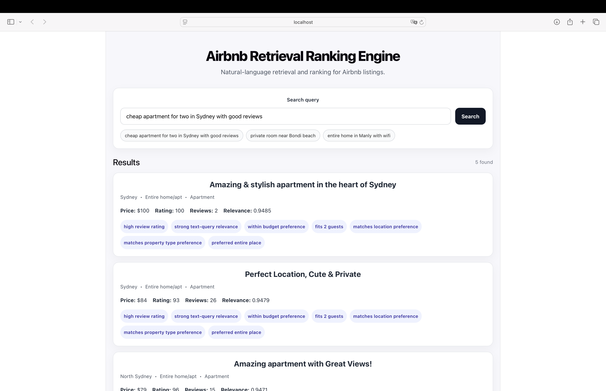
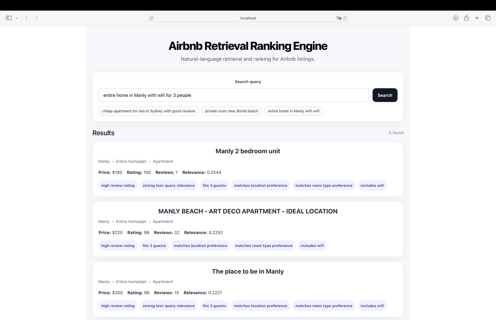

# Airbnb Retrieval Ranking Engine

A production-style full-stack retrieval and ranking system for Airbnb listings, supporting natural-language search through dense semantic retrieval and an XGBoost learned reranker.

## Overview

This project started from a simple Airbnb price prediction service and was redesigned into a search and ranking engine for natural-language listing retrieval. Instead of predicting a single scalar target, the system accepts free-form user queries such as:

- `cheap apartment for two in Sydney with good reviews`
- `private room near Bondi beach`
- `entire home in Manly with wifi for 3 people`
- `family-friendly house in Randwick`

and returns ranked Airbnb listings with interpretable matching signals.

The system is built as a two-stage pipeline:

1. **Candidate generation**
   - dense semantic retrieval over listing text using sentence embeddings
   - structured candidate generation using query-intent parsing and database filtering

2. **Reranking**
   - engineered query-listing matching features
   - XGBoost learned reranker
   - final score fusion with a rule-based baseline for stability and interpretability

---

## Demo

### Example search: Sydney apartment query



### Example search: Manly wifi query



---

## Key Features

- Natural-language Airbnb search interface
- Dense semantic retrieval using sentence-transformer embeddings
- Structured query-intent parsing for location, room type, price preference, wifi, family-friendly preference, and cancellation signals
- XGBoost learned reranker over engineered query-listing features
- Explanation tags for interpretable search results
- FastAPI backend with PostgreSQL
- React + TypeScript frontend
- Dockerised backend and database support
- Unit and integration tests
- End-to-end automation scripts for data processing, training, embedding generation, and test execution

---

## System Architecture


```text
User Query
   |
   v
Query Parser ------------------------------+
   |                                       |
   |                                       v
   |                            Structured Candidate Generator
   |                                       |
   v                                       |
Dense Embedding Retriever -----------------+
   |
   v
Merged Candidate Set
   |
   v
Feature Builder
   |
   v
XGBoost Learned Reranker
   |
   +----> Rule-based scorer / explanations
   |
   v
Final Ranked Results
   |
   v
FastAPI Response -> React Frontend
```

---
## Retrieval and Ranking Pipeline
### 1. Listing text construction

Each Airbnb listing is converted into a textual representation `listing_text` built from fields such as:
* title / name
* neighbourhood
* property type
* room type
* amenities
* description-style metadata

This provides a semantically meaningful textual object for dense retrieval.

### 2. Query understanding
The parser extracts structured intent signals from the raw query, including:
* location aliases e,g, `Bondi beach -> Waverly`
* property type
* room type
* guest count
* cheap / budget preference
* flexible cancellation
* instant bookable
* wifi requirement
* family-friendly preference

### 3. Dense semantic retrieval
The query is encoded into an embedding and compared against precomputed listing embeddings to retrieve the top semantic candidates.

### 4. Structured candidate generation
In parallel, the parsed query is converted into structured database filters to retrieve candidates satisfying strong constraints such as location, room type, property type, or guest capacity.

### 5. Learned reranking
The candidate sets are merged, features are built for each `(query, listing)` pair, and an XGBoost reranker predicts a learned relevance signal.

### 6. Final score fusion
The final ranking score is a weighted fusion of:
* learned XGBoost score
* rule-based baseline score

This improves stability while preserving interpretable explanations.

---
## Mathematical Formulation
### Dense Semantic Retrieval
Let a user query be denoted by $q$, and let a listing text be denoted by $d_i$.  
A sentence-transformer encoder $f_\theta(\cdot)$ maps both queries and listings into a shared embedding space:
$$\mathbf{z}_q = f_\theta(q), \quad \mathbf{z}_i = f_\theta(d_i)$$

with $\mathbf{z}_q, \mathbf{z}_i \in \mathbb{R}^m$ where, in the current implementation, $m = 384$.

The embeddings are $L_2$-normalised:

$$\tilde{\mathbf{z}} = \frac{\mathbf{z}}{\|\mathbf{z}\|_2}$$

so the dense retrieval similarity is simply cosine similarity, which reduces to an inner product after normalisation:

$$s_{\text{emb}}(q, d_i)=\cos(\tilde{\mathbf{z}}_q, \tilde{\mathbf{z}}_i)=\tilde{\mathbf{z}}_q^\top \tilde{\mathbf{z}}_i$$

Given a corpus of listings $\{d_1, \dots, d_N\}$, dense retrieval returns the top-$K$ candidates:

$$\mathcal{C}_{\text{dense}}(q)=\text{TopK}_{i \in \{1,\dots,N\}}\, s_{\text{emb}}(q, d_i)$$

This stage is designed to capture semantic similarity beyond exact keyword overlap. In practice, this allows the system to retrieve conceptually related listings even when the wording in the query does not literally match the listing text.

### Embedding model

The current system uses the sentence-transformer model

$$f_\theta = \texttt{all-MiniLM-L6-v2}$$

which provides a practical trade-off between semantic quality, embedding dimensionality, and inference speed.

### Structured Query-Listing Features

For each query-listing pair $(q, d_i)$, the system constructs a feature vector

$$\mathbf{x}_{q,i} \in \mathbb{R}^p$$

that combines semantic relevance, listing quality, and structured preference-matching signals.

A semantic feature vector is:

$$\mathbf{x}_{q,i}=\begin{bmatrix}
s_{\text{emb}}(q,d_i)\\
\text{rating norm}\\
\text{review count norm}\\
\text{reviews per month norm}\\
\text{availability 365 norm}\\
\text{price norm}\\
\text{price fit}\\
\text{accommodates fit}\\
\text{location match}\\
\text{property type match}\\
\text{room type match}\\
\text{wifi match}\\
\text{family home match}\\
\text{flexible cancellation match}\\
\text{instant bookable match}\\
\vdots\end{bmatrix}$$

Some features are continuous normalised statistics. For example:

$$\text{rating norm}=\frac{\text{rating}}{100}$$

$$\text{review count norm}=\min\left(\frac{\text{review count}}{500}, 1\right)$$

$$\text{availability 365 norm}=\frac{\text{availability 365}}{365}$$

Other features are query-conditioned preference scores. For example, price fit is designed to reward listings that satisfy a budget-oriented query:

$$\text{price fit}=\max\left(0, 1 - \frac{\text{price}}{300}\right)\quad \text{if the query expresses a cheap/budget preference}$$

Location matching can be expressed as a binary feature:

$$\text{location match}(q, d_i)=\begin{cases}1, & \text{if the listing neighbourhood matches the parsed location intent} \\
0, & \text{otherwise}\end{cases}$$

Similarly, wifi matching is defined as:

$$
\text{wifi match}(q, d_i)=\begin{cases}1, & \text{if the query requests wifi and the listing amenities contain wifi}\\
0, & \text{otherwise}\end{cases}$$

The same principle is used for room type, property type, cancellation policy, instant-bookable preference, and family-oriented listing suitability.

### XGBoost Learned Reranker

The reranker is a supervised model

$$g_\phi : \mathbb{R}^p \to [0,1]$$

which maps each feature vector $\mathbf{x}_{q,i}$ to a learned relevance score:

$$\hat{y}_{q,i} = g_\phi(\mathbf{x}_{q,i})$$

In the current implementation, $g_\phi$ is an XGBoost binary classifier. Its prediction can be interpreted as a learned estimate of the relevance of listing $d_i$ to query $q$.

At a high level, boosted trees form an additive model:

$$g_\phi(\mathbf{x})=\sigma\left(
\sum_{t=1}^{T} f_t(\mathbf{x})
\right),\qquad f_t \in \mathcal{F}$$

where:
- $T$ is the number of boosting rounds
- $\mathcal{F}$ is the space of regression trees
- $\sigma(\cdot)$ is the logistic link function used for binary relevance prediction

The optimisation objective can be written as:

$$\mathcal{L}=\sum_{n=1}^{M}\ell(y_n, \hat{y}_n)
+\sum_{t=1}^{T} \Omega(f_t)$$

where:

- $\ell$ is the binary logistic loss
- $y_n \in \{0,1\}$ is the training label
- $\Omega(f_t)$ is the tree-complexity regulariser

This formulation allows the model to learn nonlinear interactions between semantic retrieval signals and structured listing features, which is particularly useful in ranking settings where relevance depends on multiple heterogeneous factors.

### Pseudo-Label Construction

Because the dataset does not include real click, booking, or dwell-time feedback, the reranker is trained using pseudo-labels derived from a rule-based teacher score.

Let the handcrafted teacher score for a query-listing pair be

$$s_{\text{rule}}(q, d_i)
$$

Then the binary pseudo-label is constructed as:

$$y_{q,i}=\mathbf{1}\{s_{\text{rule}}(q, d_i) \ge \tau\}$$

where $\tau$ is a threshold chosen in configuration.

This means the learned reranker can be viewed as a form of distillation from a handcrafted ranking policy into a trainable nonlinear function over engineered features.

### Final Score Fusion

At inference time, the final ranking score is not taken from the learned model alone. Instead, it is fused with the baseline rule-based score:

$$
s_{\text{final}}(q, d_i)=\alpha \, s_{\text{ml}}(q, d_i)+(1-\alpha)\, s_{\text{rule}}(q, d_i)$$

where:
- $s_{\text{ml}}(q, d_i)$ is the XGBoost reranker score
- $s_{\text{rule}}(q, d_i)$ is the interpretable rule-based score
- $\alpha \in [0,1]$ is a fusion coefficient

This fusion improves robustness in practice by combining:
- the flexibility of the learned reranker
- the stability and interpretability of the handcrafted baseline

### Overall Retrieval-and-Ranking Objective

The end-to-end system can be understood as a two-stage architecture:

1. retrieve a candidate set

$$
\mathcal{C}(q)=\mathcal{C}_{\text{dense}}(q)
\cup\mathcal{C}_{\text{structured}}(q)$$

2. rerank all candidates using the fused final score

$$d_{(1)}, d_{(2)}, \dots, d_{(K)}=\text{SortDescending}_{d_i \in \mathcal{C}(q)}\, s_{\text{final}}(q, d_i)$$

The returned result list is therefore the top-ranked subset under a hybrid semantic-structured retrieval process followed by learned reranking.

---
## Tech Stack
### Backend
* Python 3.10
* FastAPI
* SQLAlchemy
* PostgreSQL
* Psycopg

### Machine Learning / Retrieval
* Sentence Transformers
* XGBoost
* scikit-learn
* NumPy
* Pandas

### Frontend
* React
* TypeScript
* Vite

### Tooling
* Docker
* Docker Compose
* pytest

---
## Data Source

This project is built on the **Sydney Airbnb Open Data** dataset from Kaggle.  
The dataset provides real Airbnb listing metadata for the Sydney market, including structured attributes such as neighbourhood, room type, property type, price, availability, review statistics, and amenities.

In this project, the dataset is used for:

- populating the PostgreSQL listing database
- constructing textual listing representations for semantic retrieval
- generating structured query-listing matching features
- training the XGBoost learned reranker

The original dataset should be downloaded separately from the Kaggle dataset page.

---
## Project Structure
```text
airbnb-retrieval-ranking-engine/
│
├── app/
│   ├── api/
│   │   └── search.py
│   ├── config.py
│   ├── db.py
│   ├── dependencies.py
│   ├── main.py
│   ├── models.py
│   └── schemas.py
│
├── config/
│   ├── retrieval_ranking.yaml
│   └── runtime_config.py
│
├── frontend/
│   ├── src/
│   │   ├── components/
│   │   ├── App.tsx
│   │   └── types.ts
│   └── package.json
│
├── model/
│   ├── artifacts/
│   ├── build_listing_embeddings.py
│   ├── build_training_data.py
│   ├── embedding_retriever.py
│   ├── feature_builder.py
│   ├── ml_reranker.py
│   ├── queries.txt
│   └── train_reranker.py
│
├── retrieval/
│   ├── candidate_generator.py
│   ├── parser.py
│   └── reranker.py
│
├── scripts/
│   ├── build_listing_text.py
│   ├── load_listings.py
│   ├── run_pipeline.sh
│   └── run_tests.sh
│
├── tests/
│   ├── integration/
│   └── unit/
│
├── Dockerfile
├── docker-compose.yml
├── requirements.txt
└── README.md
```

---
## Configuration
Key retrieval and ranking hyperparameters are stored in YAML:
* embedding model
* embedding top-$k$
* XGBoost parameters
* ranking score fusion weights
* pseudo-label threshold

---
## How to Run
### 1. Start PostgreSQL
```bash
docker compose up -d postgres
```

### 2. Create and activate virtual environment
```bash
python -m venv .venv
source .venv/bin/activate
pip install -r requirements.txt
```

### 3. Load the dataset
```bash
python scripts/load_listings.py --csv data/raw/listings_dec18.csv
```

### 4. Build listing text
```bash
python scripts/build_listing_text.py
```

### 5. Build training data
```bash
python model/build_training_data.py
```

### 6. Train the XGBoost reranker
```bash
python model/train_reranker.py
```

### 7. Build dense listing embeddings
```bash
python model/build_listing_embeddings.py
```

### 8. Run the backend
```bash
export TOKENIZERS_PARALLELISM=false
export OMP_NUM_THREADS=1
export MKL_NUM_THREADS=1
uvicorn app.main:app
```

### 9. Run the frontend
```bash
cd frontend
npm install
npm run dev
```

---
## One-command pipeline
A shell script is provided to automate the end-to-end offline pipeline:
```bash
bash scripts/run_pipeline.sh
```
This script can automate:
* listing ingestion
* listing text construction
* training data generation
* XGBoost training
* embedding generation

---
## Testing
### Run all tests
```bash
bash scripts/run_tests.sh
```

### Run only unit tests
```bash
bash scripts/run_tests.sh unit
```

### Run only integration tests
```bash
bash scripts/run_tests.sh integration
```

This project includes:
* parser unit tests
* reranker unit tests
* search API integration tests

---
## Example Queries
```text
cheap apartment for two in Sydney with good reviews
private room near Bondi beach
entire home in Manly with wifi
entire home in Manly with wifi for 3 people
flexible cancellation apartment in Waverley
family-friendly house in Randwick
```

---
## Engineering Notes
* Dense retrieval embeddings are precomputed offline and stored as NumPy artifacts.
* The reranker is trained offline and loaded at inference time.
* Search uses a hybrid candidate generation strategy:
    * dense semantic retrieval
    * structured database filtering
* Final ranking uses weighted fusion between learned and rule-based scores.
* Explanation tags are currently generated by the rule-based scorer for interpretability.

---
## Current Limitations
* Pseudo-labels are derived from a handcrafted teacher score rather than real user interaction logs.
* Dense retrieval is file-based rather than backed by a vector database or ANN index.
* Explanations are heuristic, not derived from model-specific attribution methods such as SHAP.
* The frontend is intentionally implemented using lightweight template and focused on demonstration rather than production UX.

---
## Future Improvements
* Replace brute-force dense retrieval with ANN search (e.g. FAISS or pgvector)
* Train on real implicit-feedback signals such as clicks or bookings
* Add SHAP-based explanation for reranker outputs
* Support richer query parsing for proximity, beach access, and quiet/stylish preference
* Add frontend filters and listing detail views
* Fully containerise the frontend and production deployment stack

---
## Why this project

This project was motivated by a very practical annoyance in everyday life: every time I look for accommodation during holidays, the search process feels far more manual and frustrating than it should be.

In practice, users rarely search with rigid database filters alone. Instead, they think in natural language:

- “cheap apartment for two in Sydney with good reviews”
- “entire home in Manly with wifi for 3 people”
- “family-friendly house in Randwick”
- “private room near Bondi beach”

Traditional listing platforms expose many filters, but the actual search experience can still feel inefficient because users must manually translate vague preferences into structured constraints, compare many listings, and repeatedly refine search results by hand.

I wanted to build a system that better matches the way people actually search in real life: starting from free-form intent, retrieving semantically relevant listings, and then ranking them using both textual relevance and structured preferences such as location, room type, guest count, reviews, price sensitivity, and amenities.

From a technical perspective, this project was also an opportunity to build a retrieval-and-ranking system end to end, combining:

- dense semantic retrieval
- query-intent parsing
- feature engineering
- learned reranking
- backend API design
- full-stack integration

The result is a project grounded in a genuine real-world pain point, while also serving as a practical exploration of modern search, ranking, and applied ML systems.